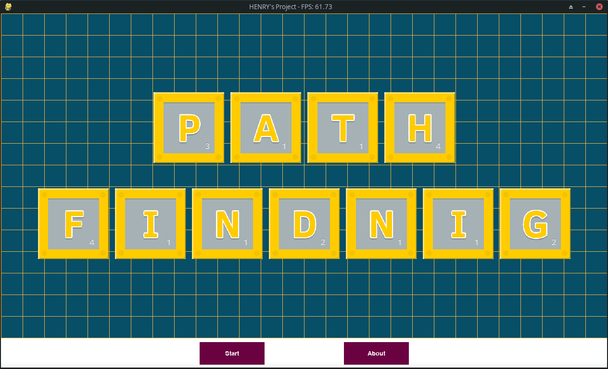
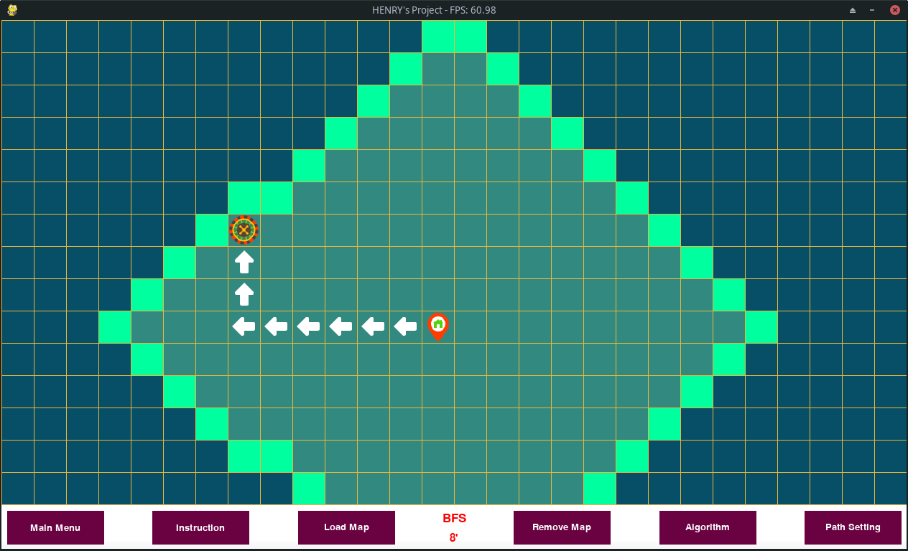
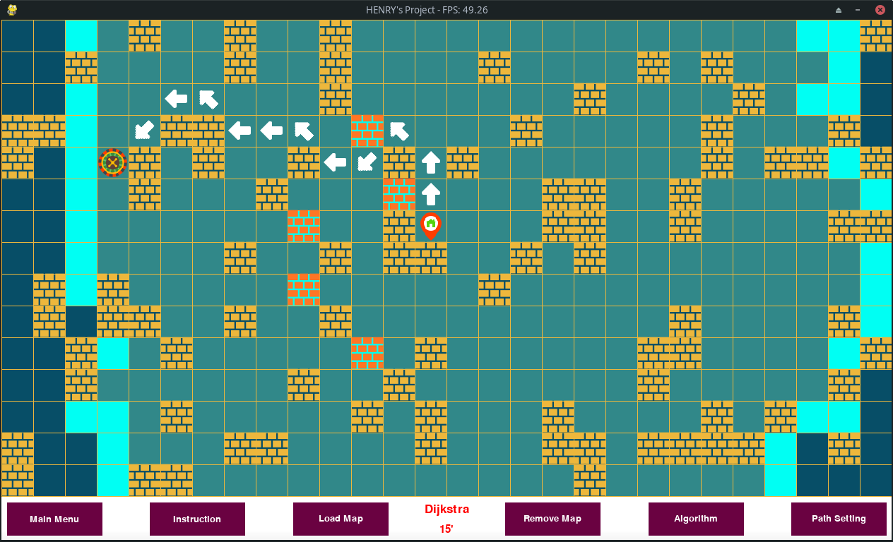

# Pathfinding
[](https://www.python.org/)
## Table of contents
* [General info](#general-info)
* [Installation](#installation)
* [Usage](#usage)
* [Screenshots](#screenshots)
* [Features](#features)
* [Status](#status)
* [License](#license)
* [Contact](#contact)

## General info
Pathfinding is a grid based project that visualize paths of searching algorithms, written in pygame.
## Installation
Requires [python](https://www.python.org/downloads/) and [pygame](https://www.pygame.org/wiki/GettingStarted) installed locally.

To run this project, open cmd (Windows)/ terminal (Linux) and run:
```
$ cd "directory of project"
$ python Main.py
```
## Usage
- Left Mouse / W Key: to place a Wall grid
- Right Mouse / D Key: to place End Marker
- Middle Mouse / L Key : to place Start Marker

  - Q Key to place Weighted Wall
  - A Key to toggle full path of arrows
  - E Key to toggle explored area
  - M Key to animate the path
  - P Key to print out the wall list ( in case, users want to save their own maps to reuse after closing )
  - Esc Key to exit
## Screenshots

Home



Straight Path



Diagonal Path

## Features
Implements path finding algorithms: 
   * BFS
   * DFS
   * Greedy B*
   * A* Euclidean
   * A* Manhattan
   * A* Diagonal
   * Dijkstra
## Status
[](https://shields.io/)
[](http://unmaintained.tech/)
## License
[](https://www.gnu.org/licenses/gpl-3.0.html)
## Contact
Created by [Henry Ta](https://github.com/Henry-Ta)
